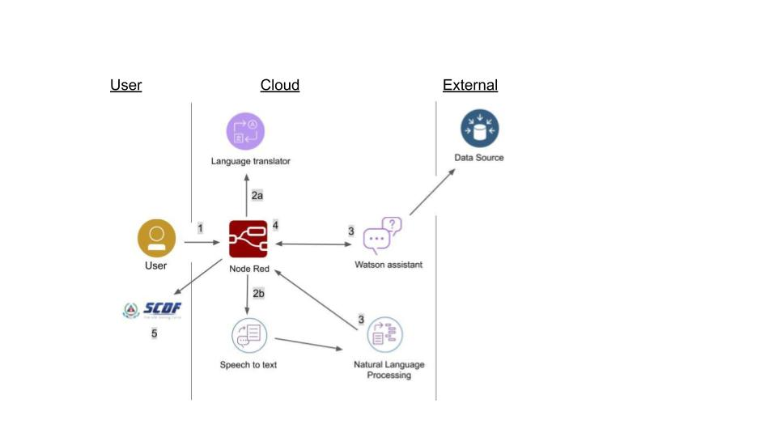

# APA

## (Aging Population Assistant)
## Contents
1. [Short description](#short-description)
1. [Video Pitch](#video-pitch)
1. [Architecture Diagram](#architecture-diagram)
1. [Long description](#long-description)
1. [Getting Started](#getting-started)
1. [Built with](#built-with)

## Short Description
### The problem
Singapore is currently experiencing an aging population and there has been a rise in the trend of elderlies with no next-of-kin. These citizens are highly susceptible to health issues and injuries, and with no next-of-kin, dangerous situations could arise. Hence, there is a need to implement a system to look after this vulnerable demographic.

### How can technology help?
With the use of technology, these elderlies will be taken care of even when living alone. 
Any emergencies experienced by them can be immediately attended to.

### The idea
With the use of tools such as IBM cloud for speech to text recognition and artificial intelligence training, we can create a system which is able to determine the emergency level of the elderly through their speech and automate the appropriate response to that situation such as mobilising CFRS or the SCDF itself for effective early intervention.

## Video Pitch

## Architecture Diagram

1. The user conveys the issue into the device as an audio file.

2. The video is sent to the cloud where the audio will be translated and then converted from speech to text.

3. The file would be sent to the Watson Assistant and Natural Language Processing service simultaneously where it would evaluate the type and severity of the problem.

4. This information would be sent to the node red software where it would determine the appropriate response for the level of the emergency faced.

5. According to the level of emergency, the community could be activated through the myResponder app or the SCDF may be activated if the situation is deemed serious.
## Long Description
[Detailed description](description.md)

## Getting Started
Unfortunately, we are unable have a running code because we do not have data to represent real situations. However, we have attached a code folder which includes how the Natural Language Processing would work using the twitter data attached as training data. The model given is for the classfication of emergencies.

## Built with
* [Node Red](https://cloud.ibm.com/catalog?search=node%20red#search_results)
* [IBM Speech to Text](https://cloud.ibm.com/catalog?search=speech%20to%20text#search_results)
* [IBM Language Translator](https://cloud.ibm.com/catalog?search=language%20translator#search_results)
* [IBM Watson Assistant](https://cloud.ibm.com/catalog?search=watson%20assistant#search_results)
